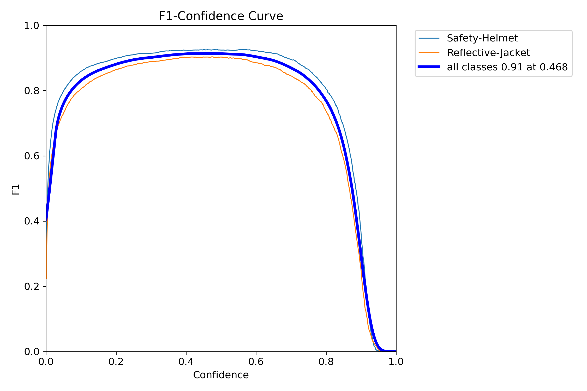

# Real-Time Safety Analysis at Worksites  

This project implements a real-time safety monitoring system using fine-tuned and pre-trained YOLO models for object detection. It is designed to enhance workplace safety by detecting and evaluating the use of Personal Protective Equipment (PPE) and monitoring improper mobile phone usage in live video streams.  

## Project Demo


## Features  

- **Object Detection**: Identifies safety helmets, reflective jackets, persons, and mobile phones in real-time using YOLO models.  
- **Dual-Model Inference**:  
  - Fine-tuned YOLO for detecting safety helmets and reflective jackets.  
  - Pretrained YOLO for detecting persons and mobile phones.  
- **Safety Scoring System**: Calculates and displays safety scores for individuals and the entire scene based on PPE usage and mobile phone behavior.  
- **Real-Time Feedback**: Provides color-coded indicators (red, yellow, green) to highlight compliance levels and prioritize safety concerns.  
- **High Accuracy**: Ensures precise detection through bounding box validation and confidence thresholds.  

## Methodology  

1. **Dataset Preparation**: A dataset of 10,500 annotated images was fine-tuned for detecting helmets and jackets.  
2. **Detection Workflow**:  
   - Fine-tuned YOLO detects helmets and jackets.  
   - Pretrained YOLO identifies persons and mobile phones.  
3. **Bounding Box Validation**: Checks positional alignment of helmets and jackets relative to detected persons.  
4. **Safety Scoring**:  
   - +50 points for wearing a helmet.  
   - +50 points for wearing a reflective jacket.  
   - -30 points for using a mobile phone improperly.  
5. **Live Camera Feed**: Processes video streams to continuously update safety scores and display compliance results.  

## System Requirements  

- **Programming Language**: Python  
- **Frameworks and Libraries**:  
  - PyTorch (for YOLO)  
  - OpenCV (for video stream processing)  
**Note: The system does not require a GPU and runs efficiently on CPU-only environments.**

## Installation  

1. Clone the repository:  
   ```bash
   git clone https://github.com/zarmeenta/Real-time-Safety-Analysis-at-Worksites.git  
   cd realtime-safety-analysis
   ```  

2. Install dependencies:  
   ```bash
   pip install -r requirements.txt  
   ```  

3. Download and place the pre-trained and fine-tuned YOLO weights in the `models` directory.  

4. Run the application:  
   ```bash
   python main.py  
   ```  

## How It Works  

1. A live video stream from a webcam is processed frame-by-frame.  
2. YOLO models detect objects and evaluate compliance with safety protocols.  
3. A color-coded visual representation of the safety status is displayed in real-time.


## Results  

- **F1-Confidence Curve**: Demonstrates the detection accuracy of fine-tuned YOLO for helmets and jackets.



  
- **Real-Time Dashboard**: Displays bounding boxes, compliance scores, and color-coded indicators.


## Applications  

- Construction sites  
- Industrial worksites  
- Warehouses and logistics centers  

## Future Enhancements  

- Integration with IoT devices for automated alerts.  
- Expansion to include additional PPE like gloves and boots.  
- Multi-camera support for larger worksite monitoring.
